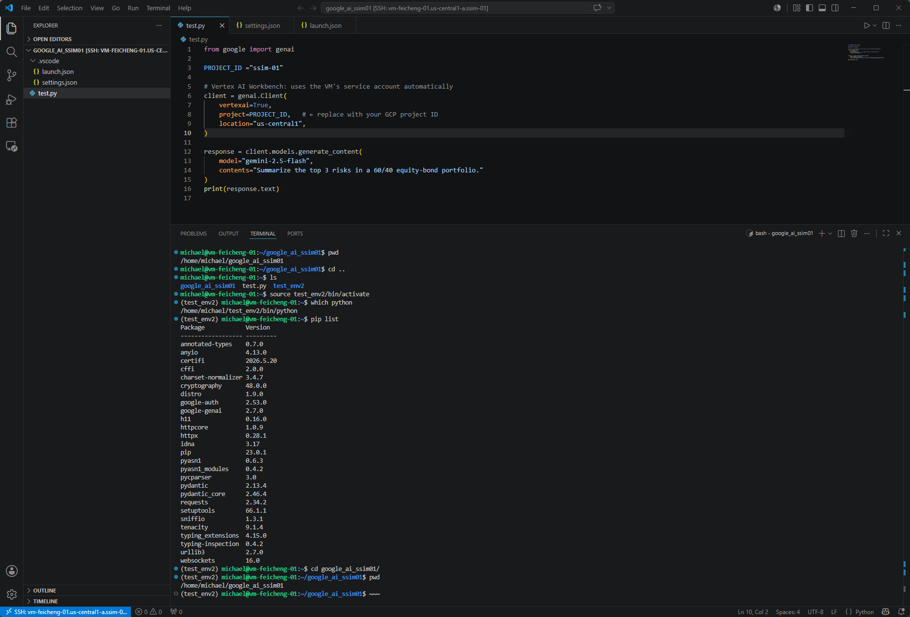

# 1. Install gclond on Windows

在 Windows 上安装 Google Cloud SDK（现在名称是 Google Cloud CLI）有几种方式。对于开发者来说，使用 Winget 或下载安装包最简单可靠。

在 Windows Terminal、PowerShell 或 CMD（管理员权限） 中执行：

```powershell
winget install Google.CloudSDK

```

安装完成后，关闭并重新打开终端，然后验证：

```bash
C:\Users\michael>gcloud --version
Google Cloud SDK 558.0.0
bq 2.1.28
core 2026.02.20
gcloud-crc32c 1.0.0
gsutil 5.35
```

# 2. 安装后初始化

```bash
# 登录 Google 账号：
gcloud auth login
浏览器会打开： wang******@gmail.com 登录并授权。

# 查看账号
C:\Users\michael>gcloud auth list
#       Credentialed Accounts
# ACTIVE  ACCOUNT
# *       wangfeicheng007@gmail.com

# To set the active account, run:
#     $ gcloud config set account `ACCOUNT`


# 查看项目：
C:\Users\michael>gcloud projects list
# PROJECT_ID                  NAME                        PROJECT_NUMBER  ENVIRONMENT
# cool-eye-269214             Google-speech2text          341738005669
# gen-lang-client-0388215430  Generative Language Client  207405554991
# gothic-citizen-81j33                                    275269914172
# ssim-01                     SSIM-01                     704807848510
# vertex-ai-test-488403       vertex-ai-test              995393065804


# 设置项目
gcloud config set project ssim-01

# 验证：
gcloud config get-value project


```


# 3. 配置 SSH（连接 GCE）

```bash
# 生成 SSH 配置：
C:\Users\michael>gcloud compute config-ssh
# You should now be able to use ssh/scp with your instances.
# For example, try running:

#   $ ssh haozho-vm-test-01.us-central1-a.ssim-01

# 执行后会自动生成： C:\Users\<user>\.ssh\config
# 以及：
# google_compute_engine
# google_compute_engine.pub


# 测试 SSH 
# 如果 VM 名称是： vm-feicheng-01, Zone：us-central1-a

gcloud compute ssh vm-feicheng-01  --zone us-central1-a
#  or （由 config-ssh 自动生成 Host 配置时）
# ssh vm-feicheng-01.us-central1-a.ssim-01
```


# 4. VS Code Remote SSH

安装完 gcloud 后, 安装 VS Code 扩展：Remote - SSH

```bash
# 运行：
gcloud compute config-ssh

```

VS Code：
Ctrl+Shift+P
Remote-SSH: Connect to Host

选择： vm-feicheng-01
即可直接在远程 GCE VM 上开发。

remote vm 按照 python extensions

